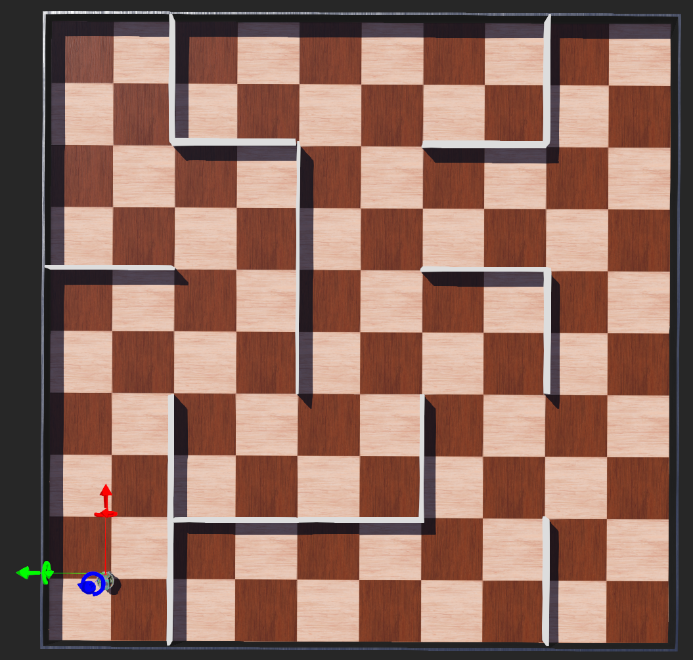

# Webots Maze Problem

A Webots simulation where an adapted e-puck robot maps a small grid maze and then navigates to a goal using a simple BDI-style controller in Python. The controller builds a 5×5 cell-edge map from LiDAR, keeps the robot centered in each cell, and plans shortest paths with a wavefront/BFS strategy.

## Features
- **Grid mapping:** cell-edge representation `[N,E,S,W] ∈ {wall, open, ?}` with post-scan harmonization.  
- **LiDAR-based wall inference:** five angular windows (left, front-left, forward, front-right, right) and an SSE threshold test.  
- **Pose maintenance:** scalar Kalman-style fusion for heading and forward-axis centering after each motion.  
- **Planner:** wavefront (BFS) for nearest-frontier exploration and goal routing.  
- **Persistence:** map saved/loaded (`map.json`) between runs.

## Repository structure
- controllers/                 # Python controllers (main maze controller lives here)
- protos/                      # Custom PROTOs
- worlds/                      # Webots world(s) for the maze

## Requirements
- **Webots** (recent version) with Python controller support
- **Python 3** (used by Webots controllers)

## Quick start
1. **Clone:** `git clone https://github.com/osamadev/webots-maze-problem.git`
2. **Open world:** Launch Webots → *File → Open World…* → choose a world under `worlds/`.
3. **Run:** Press *Play* (▶). The robot will map, calibrate, and route to the target.
4. **Reset/Replay:** Delete `map.json` (created next to the controller) to remap from scratch.

## Configuration
Tune these in the controller (under `controllers/`):
- **Grid & target:** `grid_x`, `grid_y`, `grid_size`, `target_square`
- **Motion:** `MAX_SPEED`, `TURN_TIME`, `FORWARD_TIME`
- **Mapping & fusion:** `wall_error`, `lidar_std_error`, `lidar_theta_std_error`

## How it works (brief)
- **Goal stack (BDI):** high-level goals (`mapping`, `race`) and subgoals (`route`, `move_next`, `left_turn`, `forward`, `calibrate_state`).
- **Mapping:** five LiDAR windows update cell edges; harmonization mirrors shared edges across neighbors.
- **Calibration:** after every move/turn, LiDAR-derived heading/forward cues are fused with dead reckoning to keep near cell centers.
- **Planning:** wavefront/BFS picks the next frontier during mapping and gives shortest paths to the final goal.
